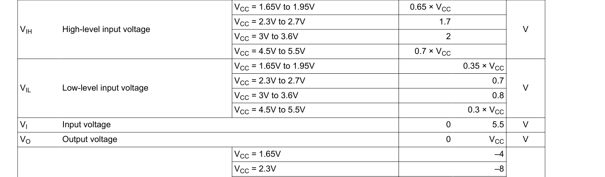
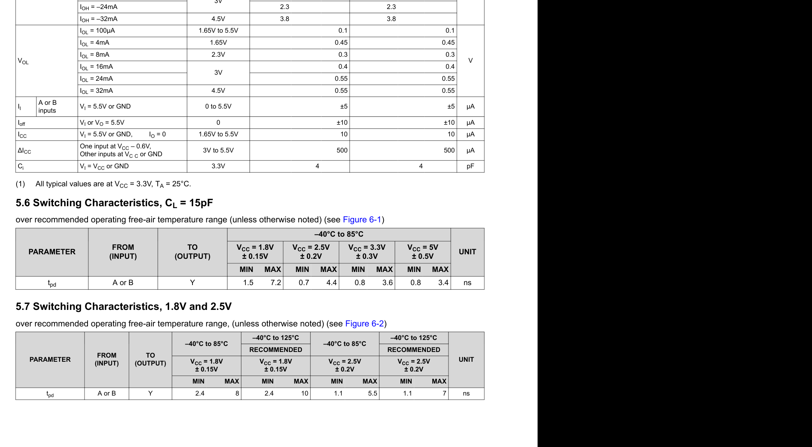
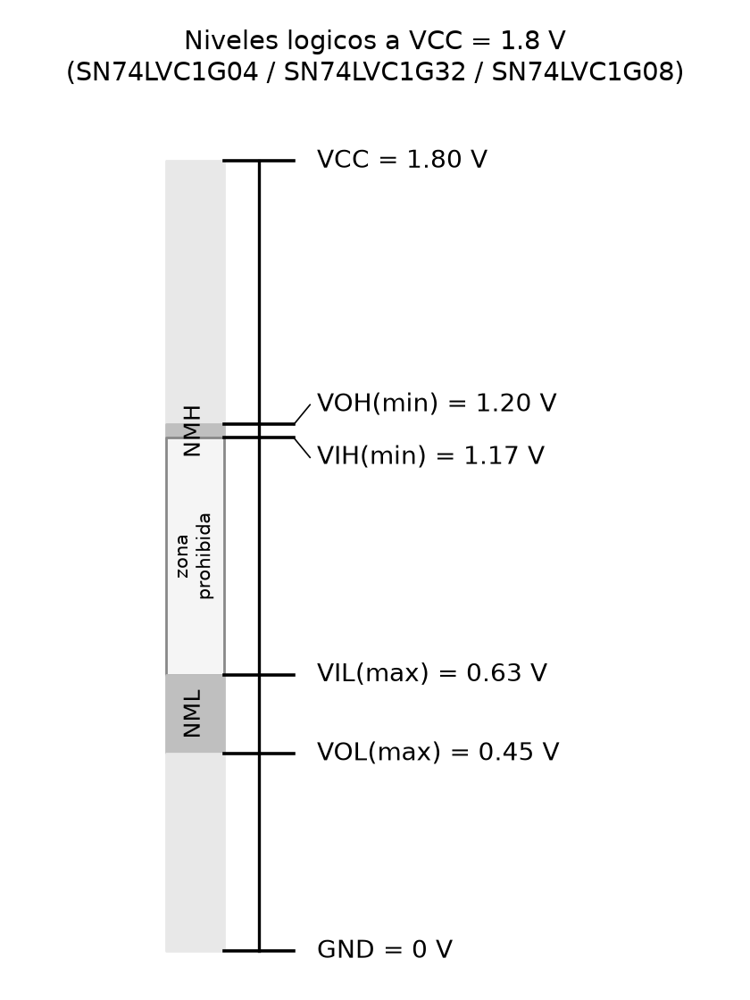

# Ejercicio 2.28 (continuación) — Digikey, margen de ruido, critical/shortest path

El circuito armado en [2.28-sop-pos.md](2.28-sop-pos.md) usa tres tipos de compuerta: un inversor (para D'), una OR y una AND. Para los puntos 2.2 a 2.4 elegí compuertas comerciales reales que operen a 1.8 V y trabajé con sus datasheets.

## 2.2 — Selección en Digikey (SMD, 1.8 V)

Busqué en Digikey compuertas discretas de un solo gate, en empaquetado de montaje superficial, de la familia **74LVC** de Texas Instruments — esta familia opera de 1.65 V a 5.5 V, así que 1.8 V está cómodamente dentro de su rango, y viene en paquetes SOT-23-5 muy pequeños (ideales para superficie). Elegí:

| Función | Parte | Empaquetado | Digikey |
|---|---|---|---|
| Inversor (NOT) | SN74LVC1G04DBVR | SOT-23-5 | [digikey.com/.../SN74LVC1G04DBVR](https://www.digikey.com/en/products/detail/texas-instruments/SN74LVC1G04DBVR/296-11599-1-ND/385738) |
| OR de 2 entradas | SN74LVC1G32DBVR | SOT-23-5 | [digikey.com/.../SN74LVC1G32DBVR](https://www.digikey.com/en/products/detail/texas-instruments/SN74LVC1G32DBVR/381323) |
| AND de 2 entradas | SN74LVC1G08DBVR | SOT-23-5 | [ti.com/lit/ds/symlink/sn74lvc1g08.pdf](https://www.ti.com/lit/ds/symlink/sn74lvc1g08.pdf) |

Las tres cuestan entre 0.12 y 0.15 USD por unidad en cantidades pequeñas. Para la OR de tres entradas del circuito (B + C + D') no encontré en Digikey un solo chip comercial de OR de 3 entradas en esta familia de bajo voltaje — en la práctica se arma con dos SN74LVC1G32 en cascada (una OR de dos entradas tomando B y C, y otra tomando esa salida junto con D'), así que para los cálculos de tiempo la trato como dos etapas de OR de 2 entradas.

Los tres datasheets (SN74LVC1G04, SN74LVC1G32, SN74LVC1G08) comparten la misma tabla de condiciones de operación recomendadas, porque son la misma familia y el mismo proceso: los niveles de voltaje de entrada no cambian entre ellos, solo cambia el tiempo de propagación de cada función.

## 2.3 — Margen de ruido a VCC = 1.8 V

De la tabla *Recommended Operating Conditions* (idéntica en los tres datasheets), a VCC = 1.8 V (dentro del rango 1.65 V–1.95 V):

$$V_{IH}(\min) = 0.65 \times V_{CC} = 0.65 \times 1.8 = 1.17\text{ V}$$
$$V_{IL}(\max) = 0.35 \times V_{CC} = 0.35 \times 1.8 = 0.63\text{ V}$$

De la tabla *Electrical Characteristics*, tomé la fila de corriente de salida más cercana a una carga real de otra compuerta de la misma familia (IOH = −4 mA / IOL = 4 mA, la condición de corriente asociada a VCC = 1.65 V, la más próxima a 1.8 V que reporta el datasheet):

$$V_{OH}(\min) = 1.20\text{ V} \qquad V_{OL}(\max) = 0.45\text{ V}$$

Con esos cuatro valores:

$$NM_H = V_{OH}(\min) - V_{IH}(\min) = 1.20 - 1.17 = 0.03\text{ V} = 30\text{ mV}$$
$$NM_L = V_{IL}(\max) - V_{OL}(\max) = 0.63 - 0.45 = 0.18\text{ V} = 180\text{ mV}$$

Las tablas del datasheet de donde salen estos valores (SN74LVC1G08, igual en los otros dos):

El margen alto (30 mV) es mucho más ajustado que el bajo (180 mV). Es un resultado típico de operar una familia de bajo voltaje cerca de su límite inferior: a 1.8 V casi no queda separación entre lo que la compuerta garantiza como "salida alta" y lo mínimo que la siguiente compuerta reconoce como "entrada alta". Con ese margen, cualquier caída de tensión en la pista, ruido acoplado o desajuste entre chips de distintos lotes puede hacer que una salida en 1 se lea como algo ambiguo en la entrada siguiente.

## 2.4 — Critical path y shortest path

El circuito tiene cuatro caminos de entrada a salida, de distinto largo:

| Camino | Compuertas que atraviesa | Cantidad |
|---|---|---|
| A → Y | AND | 1 |
| B → Y | OR + OR + AND | 3 |
| C → Y | OR + OR + AND | 3 |
| D → Y | NOT + OR + OR + AND | 4 |

(la OR de tres entradas cuenta como dos OR de dos entradas en cascada, según la nota del punto 2.2)

**Shortest path** (el más corto, A → Y, una sola compuerta): se calcula con el tiempo de propagación **mínimo** de esa compuerta, porque es el caso más rápido en el que puede cambiar la salida — y ese es precisamente el dato que interesa para el contamination delay.

$$t_{cd} = t_{pd,AND}(\min) = 2.4\text{ ns}$$

**Critical path** (el más largo, D → Y, cuatro compuertas): se calcula sumando el tiempo de propagación **máximo** de cada compuerta en la cadena, porque ese es el peor caso que determina qué tan rápido puede andar el circuito en conjunto.

$$t_{pd} = t_{pd,NOT}(\max) + 2\times t_{pd,OR}(\max) + t_{pd,AND}(\max)$$
$$t_{pd} = 7.5 + 2(8.0) + 8.0 = 31.5\text{ ns}$$

(tomé todos los t_pd de la tabla *Switching Characteristics* a VCC = 1.8 V ± 0.15 V con CL = 30/50 pF, que es la condición de carga que TI recomienda como más representativa de una placa real, en vez de la de 15 pF que asume una carga muy liviana)

| Compuerta | t_pd mín (ns) | t_pd máx (ns) |
|---|---|---|
| NOT — SN74LVC1G04 | 3.0 | 7.5 |
| OR — SN74LVC1G32 | 2.8 | 8.0 |
| AND — SN74LVC1G08 | 2.4 | 8.0 |

El contamination delay (2.4 ns) le dice al diseñador cuánto tiempo mínimo hay que esperar antes de que la salida empiece a cambiar tras un cambio en A — útil, por ejemplo, para saber cuándo un cambio ya no es seguro de "ignorar". El propagation delay (31.5 ns) marca el peor caso: cuánto hay que esperar como máximo para confiar en que Y ya terminó de estabilizarse después de cualquier cambio de entrada, y es el número que fija qué tan rápido puede correr un reloj que use esta señal como entrada a la siguiente etapa.
