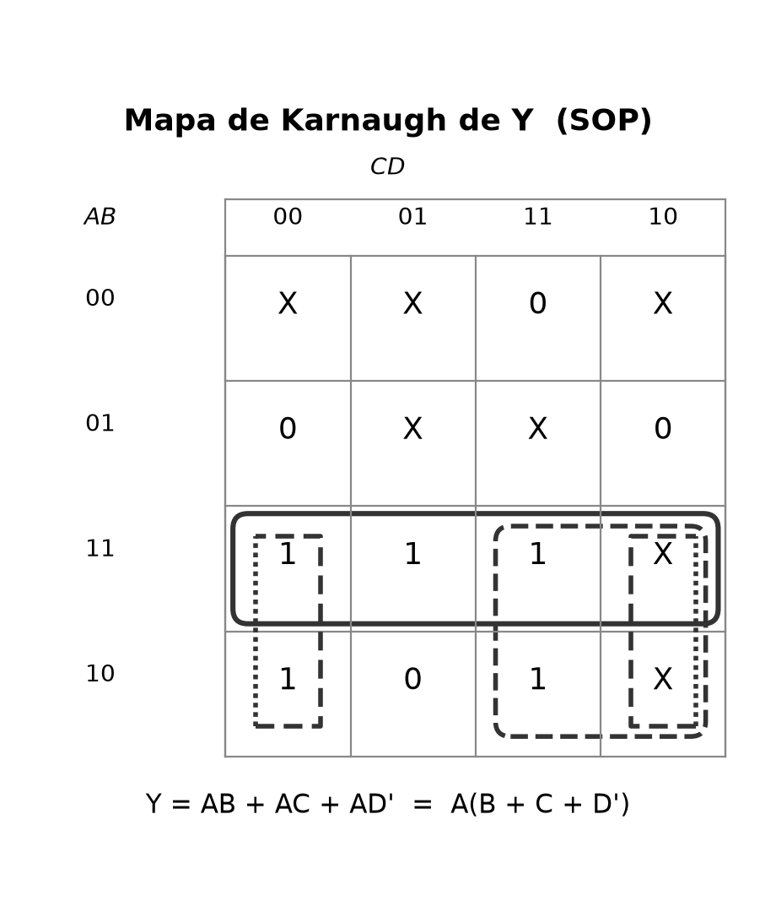
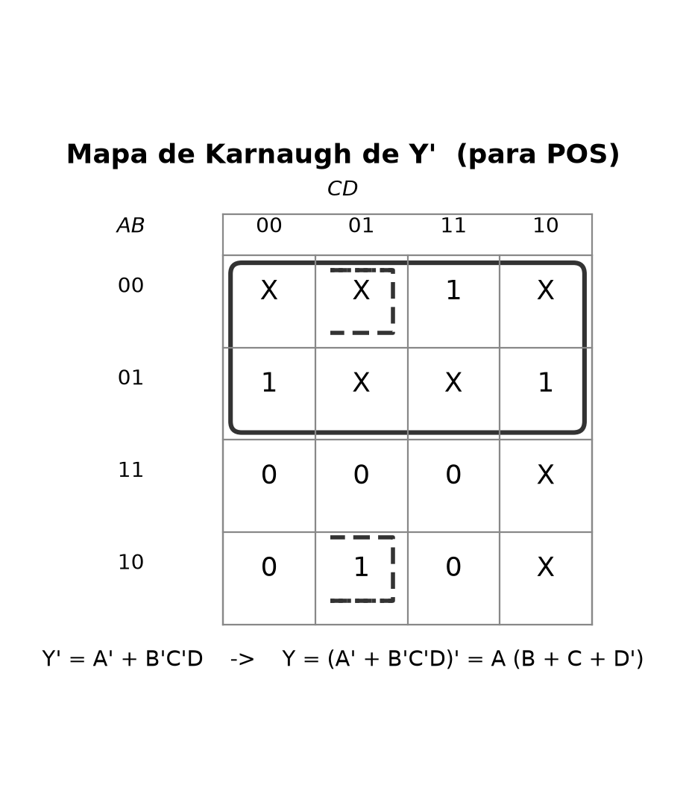
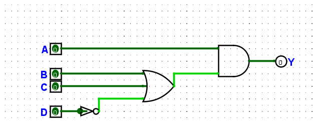

# Ejercicio 2.28 — SOP, POS y timing

**Enunciado:** a partir de la tabla de verdad de la Figura 2.85 (entradas A, B, C, D; salida Y con varias combinaciones "no importa"), completar cuatro pasos: construir el circuito por ambas estrategias (SOP y POS), seleccionar compuertas reales en Digikey para 1.8 V, calcular el margen de ruido y calcular el critical path / shortest path.

## Tabla de verdad de partida

| A | B | C | D | Y |
|---|---|---|---|---|
| 0 | 0 | 0 | 0 | X |
| 0 | 0 | 0 | 1 | X |
| 0 | 0 | 1 | 0 | X |
| 0 | 0 | 1 | 1 | 0 |
| 0 | 1 | 0 | 0 | 0 |
| 0 | 1 | 0 | 1 | X |
| 0 | 1 | 1 | 0 | 0 |
| 0 | 1 | 1 | 1 | X |
| 1 | 0 | 0 | 0 | 1 |
| 1 | 0 | 0 | 1 | 0 |
| 1 | 0 | 1 | 0 | X |
| 1 | 0 | 1 | 1 | 1 |
| 1 | 1 | 0 | 0 | 1 |
| 1 | 1 | 0 | 1 | 1 |
| 1 | 1 | 1 | 0 | X |
| 1 | 1 | 1 | 1 | 1 |

Siete de las dieciséis combinaciones son "no importa" (X): se pueden fijar en 0 o en 1, lo que sea más conveniente para simplificar. Las uso de las dos formas posibles (para armar sumas de productos o productos de sumas) y en ambos casos termino llegando a la misma expresión mínima, lo cual es una buena señal de que la simplificación está bien hecha.

## 2.1 — Construcción del circuito, por SOP y por POS

### Estrategia SOP (suma de productos)

### Tabla de mintérminos

| m | A | B | C | D | mintérmino | Y |
|---|---|---|---|---|---|---|
| m0 | 0 | 0 | 0 | 0 | A'B'C'D' | X |
| m1 | 0 | 0 | 0 | 1 | A'B'C'D | X |
| m2 | 0 | 0 | 1 | 0 | A'B'CD' | X |
| m3 | 0 | 0 | 1 | 1 | A'B'CD | 0 |
| m4 | 0 | 1 | 0 | 0 | A'BC'D' | 0 |
| m5 | 0 | 1 | 0 | 1 | A'BC'D | X |
| m6 | 0 | 1 | 1 | 0 | A'BCD' | 0 |
| m7 | 0 | 1 | 1 | 1 | A'BCD | X |
| **m8** | 1 | 0 | 0 | 0 | AB'C'D' | **1** |
| m9 | 1 | 0 | 0 | 1 | AB'C'D | 0 |
| m10 | 1 | 0 | 1 | 0 | AB'CD' | X |
| **m11** | 1 | 0 | 1 | 1 | AB'CD | **1** |
| **m12** | 1 | 1 | 0 | 0 | ABC'D' | **1** |
| **m13** | 1 | 1 | 0 | 1 | ABC'D | **1** |
| m14 | 1 | 1 | 1 | 0 | ABCD' | X |
| **m15** | 1 | 1 | 1 | 1 | ABCD | **1** |

La forma canónica (sin simplificar y sin usar los "no importa") sería la suma de los cinco mintérminos marcados, m8 + m11 + m12 + m13 + m15:

$$Y = A\overline{B}\,\overline{C}\,\overline{D} + A\overline{B}CD + ABC\overline{D} + AB\overline{C}D + ABCD$$

Esa expresión funciona pero es larga. Para reducirla armé el mapa de Karnaugh de Y y agrupé los 1 aprovechando los X que convenía tomar como 1 (los que no ayudaban a agrandar un grupo los dejé como 0, implícitamente, al no incluirlos):



Se forman tres grupos de dos casillas (2 literales cada uno): la fila completa A·B, el bloque A·C, y el par que envuelve los bordes izquierdo y derecho del mapa A·D' (D=0 está en las columnas de los extremos porque el mapa usa orden Gray). Sumando los tres:

$$Y = AB + AC + A\overline{D} = A(B + C + \overline{D})$$

### Estrategia POS (producto de sumas)

### Tabla de maxtérminos

| M | A | B | C | D | maxtérmino | Y |
|---|---|---|---|---|---|---|
| M0 | 0 | 0 | 0 | 0 | (A+B+C+D) | X |
| M1 | 0 | 0 | 0 | 1 | (A+B+C+D') | X |
| M2 | 0 | 0 | 1 | 0 | (A+B+C'+D) | X |
| **M3** | 0 | 0 | 1 | 1 | (A+B+C'+D') | **0** |
| **M4** | 0 | 1 | 0 | 0 | (A+B'+C+D) | **0** |
| M5 | 0 | 1 | 0 | 1 | (A+B'+C+D') | X |
| **M6** | 0 | 1 | 1 | 0 | (A+B'+C'+D) | **0** |
| M7 | 0 | 1 | 1 | 1 | (A+B'+C'+D') | X |
| M8 | 1 | 0 | 0 | 0 | (A'+B+C+D) | 1 |
| **M9** | 1 | 0 | 0 | 1 | (A'+B+C+D') | **0** |
| M10 | 1 | 0 | 1 | 0 | (A'+B+C'+D) | X |
| M11 | 1 | 0 | 1 | 1 | (A'+B+C'+D') | 1 |
| M12 | 1 | 1 | 0 | 0 | (A'+B'+C+D) | 1 |
| M13 | 1 | 1 | 0 | 1 | (A'+B'+C+D') | 1 |
| M14 | 1 | 1 | 1 | 0 | (A'+B'+C'+D) | X |
| M15 | 1 | 1 | 1 | 1 | (A'+B'+C'+D') | 1 |

La forma canónica sin simplificar sería el producto de los cuatro maxtérminos marcados (M3, M4, M6, M9):

$$Y = (A+B+\overline{C}+\overline{D})(A+\overline{B}+C+D)(A+\overline{B}+\overline{C}+D)(\overline{A}+B+C+\overline{D})$$

Para simplificarla es más directo trabajar con el mapa de Y' (el complemento): ahí los definitivos-1 son justo M3, M4, M6 y M9, y agrupé usando los mismos "no importa" de antes:



Toda la mitad superior del mapa (A=0, ocho casillas) es 1 o X, así que forma un solo grupo de ocho casillas: un único literal, A'. Falta cubrir el par que envuelve los bordes superior e inferior del mapa (m1 y m9), que da B'C'D. Entonces:

$$Y' = \overline{A} + \overline{B}\,\overline{C}D$$

Aplicando De Morgan para volver a Y (esto es exactamente lo que hace la estrategia POS: cada término de la suma de Y' se convierte en un factor, y cada literal se complementa):

$$Y = \overline{Y'} = A \cdot (B + C + \overline{D})$$

## Las dos estrategias llegan a la misma expresión

$$Y = A(B + C + \overline{D})$$

Es la misma ecuación por SOP y por POS. Tiene sentido: al minimizar con mapas de Karnaugh se busca la expresión de menor costo, y para esta tabla en particular esa expresión mínima resulta ser, a la vez, una suma de productos (AB + AC + AD') y, factorizada, un producto de una suma (A veces (B+C+D')) — no son dos circuitos distintos, es la misma función escrita de dos formas.

## Circuito construido y verificado en Logisim Evolution

Construí el circuito de la expresión ya factorizada (un inversor para D, una OR de tres entradas para B+C+D', y una AND de dos entradas para el producto con A), que es la que usa menos compuertas:



Verifiqué las 16 combinaciones con el modo de línea de comandos de Logisim Evolution (`--tty table`), que simula el archivo `.circ` directamente y devuelve la tabla de verdad real del circuito construido, sin intervención manual:

```
A B C D Y
0 0 0 0 0
0 0 0 1 0
0 0 1 0 0
0 0 1 1 0
0 1 0 0 0
0 1 0 1 0
0 1 1 0 0
0 1 1 1 0
1 0 0 0 1
1 0 0 1 0
1 0 1 0 1
1 0 1 1 1
1 1 0 0 1
1 1 0 1 1
1 1 1 0 1
1 1 1 1 1
```

Coincide exactamente con la tabla de partida en las once combinaciones que sí estaban definidas (0 o 1); en las siete "no importa" el circuito, como es lógico, decide un valor fijo (0 o 1) según cómo terminaron agrupadas en el mapa.

El archivo `.circ` está en [`circuitos/ex2_28_sop.circ`](../circuitos/ex2_28_sop.circ).

## 2.2, 2.3 y 2.4 — Digikey, margen de ruido y timing

Estos tres puntos quedaron en un documento aparte porque involucran datasheets y cálculos propios: [`2.28-digikey-nm-timing.md`](2.28-digikey-nm-timing.md).
