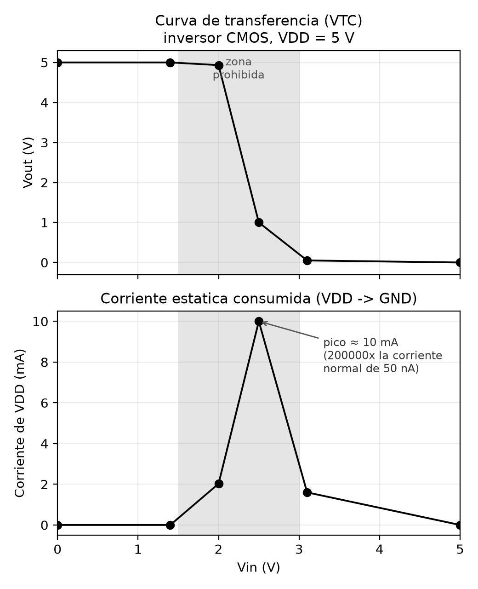

# Forbidden zone

**Enunciado:** forzar una compuerta a operar en su zona prohibida y evaluar su comportamiento, con tres partes: construcción física con osciloscopio, simulación, y una reflexión sobre las consecuencias.

## Por qué existe una zona prohibida

Una compuerta digital solo garantiza su comportamiento cuando la entrada está por debajo de VIL o por encima de VIH. Entre esos dos umbrales no hay ninguna garantía: no es que el circuito "no sepa qué hacer" en un sentido abstracto, es que un transistor MOSFET no es un interruptor ideal — conduce más o menos según qué tan lejos esté su V_GS de su voltaje de umbral, y en esa franja intermedia ni el PMOS ni el NMOS del inversor quedan completamente cortados. Los dos conducen algo a la vez.

## Simulación

Para forzar la entrada a un voltaje intermedio arbitrario (no solo 0 o VDD) hace falta un simulador **analógico** de verdad, no uno puramente digital. Por eso esta parte no se puede hacer en Logisim: Logisim no modela transistores como resistencias variables dependientes del voltaje, solo maneja estados 0/1/flotante/error, así que nunca calcularía una salida "a medias" ni una corriente de cortocircuito — eso requiere resolver las ecuaciones del transistor en función del voltaje real de la entrada, que es exactamente lo que hace un simulador tipo SPICE.

Usé el simulador de circuitos de [Falstad](https://www.falstad.com/circuit/circuitjs.html) (circuito de ejemplo "Inversor CMOS", en Ejemplos de circuitos → Familias lógicas → CMOS), que sí simula los dos MOSFET a nivel de transistor. Reemplacé la entrada lógica del ejemplo por una fuente de tensión variable (deslizable de 0 a 5 V) y fui midiendo, para distintos valores de entrada, el voltaje de salida y la corriente que la fuente de VDD entrega al circuito:

| Vin (V) | Vout medido | Corriente de VDD | Comentario |
|---|---|---|---|
| 0.0 | 5.000 V | 50 nA | entrada válida en 0 — salida limpia en 1 |
| 1.4 | 5.000 V | 50 nA | todavía por debajo de VIL — salida limpia |
| 2.0 | 4.933 V | 2.025 mA | ya dentro de la zona prohibida — la salida empieza a degradarse |
| 2.5 | **1.000 V** | **10.0 mA** | centro de la zona prohibida (VDD/2) — salida inválida, corriente máxima |
| 3.1 | 0.051 V | 1.6 mA | saliendo de la zona — la salida ya casi es un 0 válido |
| 5.0 | 0.000 V | 50 nA | entrada válida en VDD — salida limpia en 0 |

Dos cosas se ven en los datos. Primero, la salida deja de ser un voltaje binario limpio: a Vin = 2.5 V la salida da 1 V, que no es ni un 0 válido (debería estar por debajo de VOL) ni un 1 válido (debería estar por encima de VOH) — es un voltaje que la siguiente compuerta puede interpretar de cualquier manera, incluso de forma distinta según variaciones de fabricación entre chips iguales. Segundo, y más importante en la práctica: la corriente que consume el circuito se dispara de 50 nA a 10 mA, un factor de 200 000. Esa corriente no hace ningún trabajo útil — no carga ninguna capacitancia ni mueve ninguna señal — es corriente que pasa directo de VDD a tierra a través de los dos transistores parcialmente encendidos al mismo tiempo (lo que en electrónica de potencia se conoce como *corriente de cortocircuito* o *shoot-through*).

## Consecuencias de operar en la zona prohibida

La consecuencia inmediata es eléctrica: la compuerta deja de comportarse como un interruptor y empieza a comportarse como una resistencia entre VDD y tierra, disipando potencia todo el tiempo que la entrada se quede ahí (en el punto medido, P = V×I = 5 V × 10 mA = 50 mW, contra los 250 nW de un estado normal — otro factor de casi 200 000). En un circuito real esto se traduce en calentamiento del chip y en consumo de batería que no tiene ninguna función lógica.

La segunda consecuencia es funcional: como la salida no es ni un 0 ni un 1 confiable, cualquier compuerta que reciba esa señal como entrada puede interpretarla de cualquiera de las dos formas, y no necesariamente de forma consistente en el tiempo (dos flancos que pasan por la zona prohibida a distinta velocidad pueden terminar interpretados distinto). Esto es precisamente la causa de los glitches de la última parte de la tarea: cuando dos caminos de una misma señal llegan a una compuerta en momentos ligeramente distintos, hay un instante en que la entrada de esa compuerta pasa por un voltaje intermedio, y el resultado en ese instante no está garantizado por la hoja de datos.

En la práctica, una entrada queda en la zona prohibida por dos motivos típicos: una entrada sin conectar (flotante, que puede asentarse en cualquier voltaje por acoplamiento capacitivo con el ambiente) o una señal que cambia de nivel más lento de lo que la siguiente compuerta espera — por ejemplo una señal larga en una pista sin buffer, atenuada por resistencia y capacitancia parásitas. Por eso las hojas de datos siempre piden no dejar entradas flotando y respetar los tiempos de subida/bajada máximos permitidos.

## Construcción con osciloscopio real

Esta parte queda pendiente porque requiere hardware físico (protoboard, fuente variable y osciloscopio real) que no puedo operar. El procedimiento sería: armar el mismo inversor CMOS (o una compuerta TTL/CMOS comercial) en protoboard, alimentar la entrada con un potenciómetro como divisor de voltaje entre VDD y tierra, y con el osciloscopio en la salida ir girando el potenciómetro lentamente mientras se observa cómo la salida deja de ser un cuadrado limpio y pasa por la misma zona intermedia que se ve en la simulación de arriba — idealmente tomando una foto de la pantalla del osciloscopio en el punto medio, similar a la fila de la tabla en Vin ≈ 2.5 V. Cuando la hagas, mandame las fotos y las integro al repositorio.
