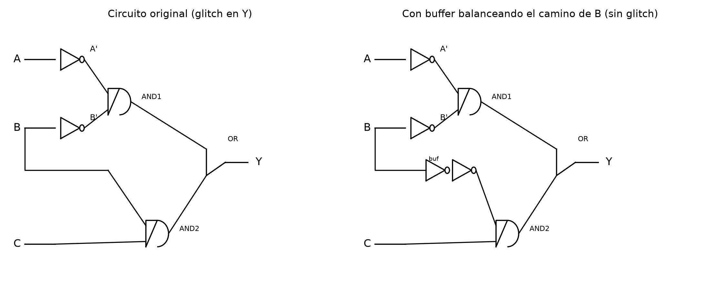
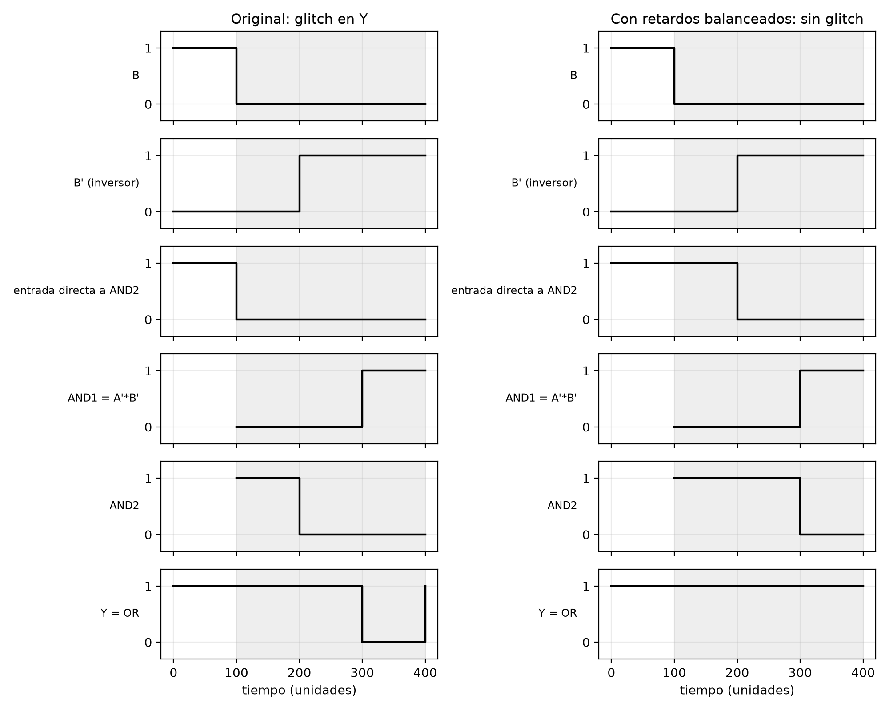

# Glitch

**Enunciado:** replicar el circuito de la Figura que genera un glitch, explicar qué es un glitch y por qué este circuito lo presenta, graficar el comportamiento con un simulador que permita configurar el retardo de cada compuerta, y repetir el ejercicio aplicando la técnica del libro de "atrasar todas las señales" para comprobar que el glitch desaparece.

**Nota sobre la herramienta:** el enunciado sugiere CircuitVerse porque permite fijar un retardo numérico por compuerta (cosa que Logisim no deja hacer). Intenté construir el circuito ahí, tanto arrastrando componentes como usando la consola del navegador para armarlo directamente sobre el modelo interno del simulador, pero en los dos casos el lienzo no llegó a dibujar lo que iba agregando — es una limitación de automatizar esa página en particular, no del circuito. En vez de forzarlo, hice yo mismo una simulación de eventos discretos (el mismo modelo que usa cualquier simulador digital con retardo configurable: cada señal cambia un tiempo fijo *después* de que cambia la señal que la origina) para las dos versiones del circuito. Si en algún momento querés reproducirlo a mano en CircuitVerse para el video, dejo more abajo exactamente qué compuertas y conexiones armar.

## El circuito

Cuatro compuertas: dos inversores, dos AND y una OR.

$$Y = \overline{A}\,\overline{B} + BC$$

A y B pasan cada uno por un inversor (A', B'), que junto con C alimentan las dos AND: AND1 = A'·B', AND2 = B·C (usando B *antes* de invertirlo). La OR de esos dos productos da Y.

## Por qué este circuito genera un glitch

B llega a la salida por dos caminos de distinto largo: directo (0 compuertas) hasta AND2, e invertido (1 compuerta, el inversor) hasta AND1. Cuando B cambia, esos dos caminos no le llegan a la OR al mismo tiempo — uno se actualiza antes que el otro — y durante esa ventana la OR puede ver una combinación de entradas que no corresponde a ningún estado real, ni al de antes ni al de después del cambio.

Con A = 0 y C = 1 fijos, Y debería quedarse en 1 sin importar qué haga B (si B=1, Y=1 por BC; si B=0, Y=1 por A'B'). Pero al cambiar B de 1 a 0: el camino directo hace que AND2 baje a 0 casi de inmediato, mientras que AND1 todavía tarda el retardo del inversor en subir a 1 (porque B' todavía no reaccionó). Durante ese intervalo las dos entradas de la OR están en 0 a la vez, y Y cae a 0 un instante — el glitch — antes de volver a 1 solo. Es exactamente el caso de la fila "A=0, B: 1→0, C=1" que aparece marcada en la figura del enunciado.

## Simulación con retardo de compuerta configurable

Le di a cada compuerta un retardo de 100 unidades (el enunciado sugiere exagerar de 10 a 100 para que el evento se vea bien) y dejé que B cambie de 1 a 0 en t=100, con A=0 y C=1 fijos desde el principio:

En el lado izquierdo (circuito original) se ve la cadena de retardos: B cambia en t=100, B' reacciona en t=200 (un retardo de compuerta después), AND2 cae a 0 en t=200 (le llega B directo, un solo retardo desde t=100), AND1 sube a 1 recién en t=300 (dos retardos desde el cambio de B: inversor + AND). Entre t=200 y t=300 las dos entradas de la OR están en 0, así que la salida de la OR — con su propio retardo — cae a 0 entre t=300 y t=400: ese es el glitch, de 100 unidades de ancho.

## Corrección: atrasar todas las señales

La técnica del libro no agrega ningún término lógico nuevo (a diferencia del truco del término de consenso): iguala los tiempos de llegada de cada señal a las compuertas que la combinan. Acá el desbalance es que B llega a AND2 sin pasar por ninguna compuerta, mientras que a AND1 le llega como B' después de un inversor. La corrección es meter un **buffer no inversor** (dos inversores en serie, que cancelan la negación pero conservan el retardo) en el camino directo de B hacia AND2, con el mismo retardo que el inversor de B'.

Con eso, B (ya buffereado) le llega a AND2 en t=200 — el mismo instante en que B' le llega a AND1 — así que AND1 y AND2 cambian de estado exactamente al mismo tiempo (t=300 los dos, un retardo de compuerta después). La OR nunca ve una combinación intermedia inválida, y Y se queda en 1 todo el tiempo, sin ningún hueco (lado derecho del diagrama de arriba).

## Para reproducirlo en CircuitVerse manualmente

Si querés armarlo vos en la página para el video: agregá 3 entradas (A, B, C), dos compuertas NOT, dos AND de 2 entradas, una OR de 2 entradas y una salida. Conectá A→NOT1→AND1(entrada 1), B→NOT2→AND1(entrada 2), B directo →AND2(entrada 1) [ojo: B se conecta dos veces, una directo y otra a través de NOT2], C→AND2(entrada 2), AND1 y AND2 → OR → salida. Hacé clic en cada compuerta para abrir sus propiedades y subir el "Delay" de 10 a 100. Poné A=0, C=1, y cambiá B de 1 a 0 con el circuito corriendo — el graficador de la parte de arriba (Timing Diagram) va a mostrar el mismo hueco de la simulación de arriba. Para la corrección, agregá dos NOT en serie en el cable directo de B hacia AND2.
