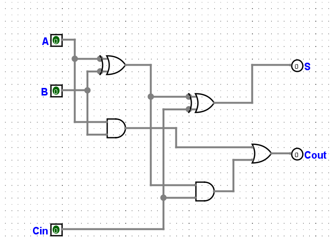
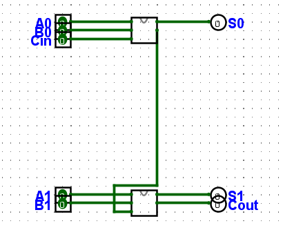

# Timing + sumador de 1 bit y 2 bits

**Enunciado:** construir un sumador completo de 1 bit (en protoboard para IET, en Logisim para ISCC), comprobar su funcionamiento, medir contamination delay y propagation delay con compuertas reales de Digikey a 1.8 V y 25 °C, extenderlo a 2 bits y repetir el cálculo de tiempos, y construir la versión de 2 bits de forma jerárquica en Logisim invocando dos instancias del sumador de 1 bit.

## El circuito

Un sumador completo de 1 bit tiene tres entradas (A, B, Cin) y dos salidas:

$$S = A \oplus B \oplus C_{in} \qquad C_{out} = AB + C_{in}(A \oplus B)$$

Lo armé con la topología estándar (la misma de la Figura del enunciado): dos XOR en cascada para S, dos AND y una OR para Cout, reutilizando la salida del primer XOR (A⊕B) para no repetir esa señal.



## Verificación lógica

En vez de simular manualmente combinación por combinación, usé el modo de línea de comandos de Logisim Evolution (`--tty table`), que recorre las 8 combinaciones de A, B y Cin y devuelve la tabla de verdad real del circuito construido:

```
A B Cin S Cout
0 0   0 0    0
0 0   1 1    0
0 1   0 1    0
0 1   1 0    1
1 0   0 1    0
1 0   1 0    1
1 1   0 0    1
1 1   1 1    1
```

Coincide exactamente con la tabla de verdad de un sumador completo (S y Cout son la suma A+B+Cin escrita en binario en cada fila). El archivo está en [`circuitos/sumador1bit.circ`](../circuitos/sumador1bit.circ).

## Compuertas reales para el cálculo de tiempos (1.8 V, SOT-23-5)

El circuito usa tres funciones: XOR, AND y OR. A las dos últimas ya las había seleccionado para el Ejercicio 2.28 ([ver esa sección](2.28-digikey-nm-timing.md)); agregué la XOR de la misma familia y empaquetado:

| Función | Parte | Empaquetado | Digikey |
|---|---|---|---|
| XOR de 2 entradas | SN74LVC1G86DBVR | SOT-23-5 | [digikey.com/.../SN74LVC1G86DBVR](https://www.digikey.com/en/products/detail/texas-instruments/SN74LVC1G86DBVR/381329) |
| AND de 2 entradas | SN74LVC1G08DBVR | SOT-23-5 | [digikey.com/.../SN74LVC1G08DBVR](https://www.digikey.com/en/products/detail/texas-instruments/SN74LVC1G08DBVR/296-11601-1-ND/385740) |
| OR de 2 entradas | SN74LVC1G32DBVR | SOT-23-5 | [digikey.com/.../SN74LVC1G32DBVR](https://www.digikey.com/en/products/detail/texas-instruments/SN74LVC1G32DBVR/381323) |

Tiempos de propagación a VCC = 1.8 V ± 0.15 V, CL = 30/50 pF, rango −40 °C a 85 °C (25 °C cae dentro de ese rango; el datasheet no da un valor aparte solo para 25 °C a este voltaje, únicamente a 3.3 V, así que uso los límites garantizados que sí cubren 25 °C):

| Compuerta | t_pd mín (ns) | t_pd máx (ns) |
|---|---|---|
| XOR — SN74LVC1G86 | 3.5 | 9.9 |
| AND — SN74LVC1G08 | 2.4 | 8.0 |
| OR — SN74LVC1G32 | 2.8 | 8.0 |

## Contamination delay y propagation delay — sumador de 1 bit

Hay varios caminos posibles de una entrada a una salida, de distinto largo:

| Camino | Compuertas | Cantidad |
|---|---|---|
| Cin → S | XOR2 | 1 |
| A/B → AND1 → OR → Cout | AND, OR | 2 |
| Cin → AND2 → OR → Cout | AND, OR | 2 |
| A/B → XOR1 → XOR2 → S | XOR, XOR | 2 |
| A/B → XOR1 → AND2 → OR → Cout | XOR, AND, OR | 3 |

**Shortest path** (Cin → S, una sola compuerta): se usa el t_pd **mínimo**, porque es el caso más rápido en que la salida puede empezar a cambiar.

$$t_{cd} = t_{pd,XOR}(\min) = 3.5\text{ ns}$$

**Critical path** (A/B → XOR1 → AND2 → OR → Cout, tres compuertas, el camino más largo): se suman los t_pd **máximos**.

$$t_{pd} = t_{pd,XOR}(\max) + t_{pd,AND}(\max) + t_{pd,OR}(\max) = 9.9 + 8.0 + 8.0 = 25.9\text{ ns}$$

El contamination delay (3.5 ns) es el tiempo mínimo garantizado durante el cual la salida sigue siendo válida después de un cambio en la entrada — útil para saber, por ejemplo, cuánto puede acercarse un flanco de reloj sin arriesgar una lectura vieja. El propagation delay (25.9 ns) es el peor caso: el tiempo que hay que esperar siempre para confiar en que S y Cout ya terminaron de estabilizarse, y es el número que limita qué tan rápido puede correr un sistema que encadene sumadores.

## Extensión a 2 bits

Armé el sumador de 2 bits de forma **jerárquica**: construí `sumador1bit` como un circuito aparte dentro del mismo archivo, y el circuito de nivel superior (`main`) simplemente coloca dos instancias de `sumador1bit` y conecta el Cout de la primera al Cin de la segunda — sin volver a dibujar ninguna compuerta.



Verificación con las 32 combinaciones (A1A0 + B1B0 + Cin, comprobando que S1S0 y Cout sea la suma binaria correcta), otra vez con `--tty table`: las 32 filas coinciden. El archivo está en [`circuitos/sumador2bit.circ`](../circuitos/sumador2bit.circ).

### Contamination y propagation delay — sumador de 2 bits

El camino más corto no cambia (Cin externo → XOR2 del primer bit → S0, sigue siendo 1 sola compuerta): $t_{cd} = 3.5$ ns.

El camino más largo ahora tiene que atravesar el primer sumador completo y además la etapa de acarreo del segundo, porque Cout del bit 0 es el Cin del bit 1:

$$A_0/B_0 \to \text{XOR1}_0 \to \text{AND2}_0 \to \text{OR}_0 \,[=C_{out,0}] \to \text{AND2}_1 \to \text{OR}_1 \,[=C_{out}]$$

Son 5 compuertas en cascada:

$$t_{pd} = t_{pd,XOR}(\max) + 2\times t_{pd,AND}(\max) + 2\times t_{pd,OR}(\max) = 9.9 + 2(8.0) + 2(8.0) = 41.9\text{ ns}$$

Cada bit adicional en cascada le suma un AND y un OR al peor camino (t_pd,AND(max) + t_pd,OR(max) = 16 ns por bit extra): esa es la razón por la que un sumador *ripple-carry* como este se vuelve lento cuando se encadenan muchos bits, y por la que en la práctica los sumadores anchos usan esquemas de acarreo anticipado (*carry-lookahead*) en vez de simplemente encadenar sumadores de 1 bit.

## Construcción en protoboard (IET)

Esta parte la armás vos con hardware real; acá dejo la lista de materiales y el procedimiento.

**Materiales** (además del protoboard y cables): 3× SN74LVC1G86DBVR (XOR), 2× SN74LVC1G08DBVR (AND), 1× SN74LVC1G32DBVR (OR) para el sumador de 1 bit — para el de 2 bits duplicá todo salvo la OR final, que sigue siendo una; una fuente de 1.8 V (o el regulador que estés usando en el laboratorio); LEDs y resistencias de 330 Ω para ver S y Cout si no vas a usar el osciloscopio para todo; puntas de multímetro u osciloscopio para medir los tiempos.

**Procedimiento para el sumador de 1 bit:**
1. Armá las cinco compuertas según el diagrama de arriba, alimentando cada una a 1.8 V.
2. Con A, B, Cin en interruptores (o puentes a VCC/GND), comprobá las 8 combinaciones de la tabla de verdad contra lo que muestran los LEDs de S y Cout.
3. Para medir el propagation delay real: generá un flanco rápido en A (por ejemplo con un generador de señales o cambiando el interruptor mientras el osciloscopio dispara por ese canal), y con el otro canal del osciloscopio en Cout medí el tiempo entre el flanco de entrada y el momento en que Cout cruza el 50% de su excursión. Repetí para el camino más corto (Cin a S) para estimar el contamination delay. Compará esos números medidos contra los 3.5 ns / 25.9 ns calculados arriba — vas a medir más, porque el cálculo de la hoja de datos no incluye la capacitancia de tus propios cables de protoboard, que es bastante mayor que los 30–50 pF del datasheet.
4. Para el de 2 bits: armá una segunda copia del circuito y conectá el Cout del primero al Cin del segundo, y repetí las mediciones para el camino largo (A0/B0 hasta el Cout final).

Cuando tengas las capturas del osciloscopio y las fotos del protoboard armado, mandámelas y las agrego al repositorio en lugar de esta sección de texto.
